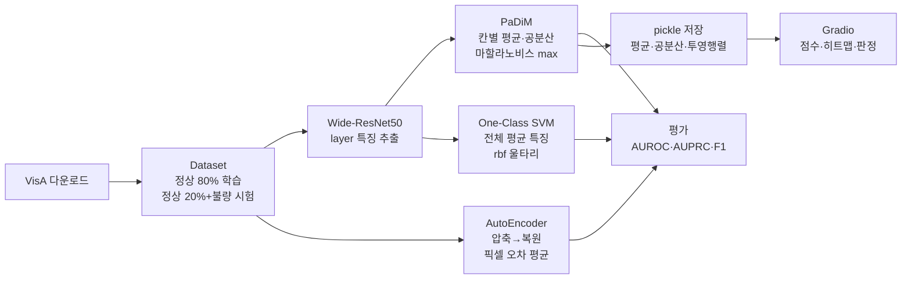

# 제조업 실시간 이상탐지: PaDiM · AutoEncoder · One-Class SVM

VisA 데이터셋의 PCB(`pcb4`)로 정상 사진만 학습하는 이상탐지 모델 세 가지를 비교하고,
강사 노트북의 결과가 왜 그렇게 나왔는지를 실험 10개로 추적한 프로젝트입니다.

> 모두의연구소 AX Bootcamp · 컴퓨터 비전 · 프로젝트 노드 6

## 데이터

| 항목 | 내용 |
| --- | --- |
| 출처 | VisA (Amazon, `VisA_20220922.tar`) 중 `pcb4` |
| 구성 | 정상 1,005장 · 불량 100장 (결함 유형 27종: missing, extra, dirt, damage 등) |
| 학습 | **정상만** 804장 (정상의 앞 80%) |
| 시험 | 정상 201장 + 불량 100장 전부 |
| 백본 | Wide-ResNet50 (ImageNet 사전학습, 가중치 고정) |
| GPU | Colab T4 |

불량은 드물고 종류를 미리 다 알 수 없으므로, 정상이 어떻게 생겼는지만 배우고
거기서 벗어난 정도를 점수로 씁니다.

## 실행 흐름



## 결과

### 강사 노트북 그대로

| 모델 | AUROC | AUPRC | Best F1 |
| --- | --- | --- | --- |
| PaDiM | 0.958 | 0.890 | 0.865 |
| One-Class SVM | 0.827 | 0.717 | 0.669 |
| AutoEncoder | **0.265** | 0.226 | 0.525 |

### 원인을 고친 뒤

| 모델 | 바꾼 것 | AUROC |
| --- | --- | --- |
| PaDiM | 학습 뒤집기 제거 + layer1 추가 | 0.958 → **0.979** |
| One-Class SVM | 학습 뒤집기 제거 | 0.817 → **0.872** |
| AutoEncoder | 디코더 끝 Sigmoid 제거 | 0.271 → **0.928** |

## 주요 발견

1. **AutoEncoder 0.265는 출력 범위 고장이었다.** 입력은 Normalize로 −2.1\~+2.6인데 출력은
   Sigmoid 때문에 0\~1에 갇힌다. 모델 없이 "0\~1 밖으로 나간 픽셀 양"만으로 점수를 매겨도
   0.25가 나와서, 원래 모델이 결함이 아니라 극단 색 픽셀 양을 재고 있었음을 확인했다.
2. **이상탐지에서 증강은 "정상"의 범위를 넓힌다.** 학습 때 좌우 뒤집기를 켜면 PaDiM은
   위치별 정상 분포가 섞이고(0.974 → 0.958), SVM은 정상 무리가 두 덩어리가 되어
   울타리가 넓어진다(0.872 → 0.817). 시험에 나오지 않을 변형까지 정상으로 넓히면 불량이
   그 안에 숨는다.
3. **PaDiM이 잘 되는 이유를 하나씩 빼 보며 확인했다.** 위치별 저장, 얕은 층의 세밀한 위치
   (layer4만 0.928), 마할라노비스(유클리드 0.909), max 채점(mean 0.931).
4. **Gradio의 판정 기준 15는 정상 사진의 67%를 불량으로 판정한다.** 이 모델의 정상 점수
   중앙값이 17.6이다. 강의에서 말한 23.3은 다른 모델의 값이고, 셀 [23]의 최적 임계값은
   시험 세트로 골라서 낙관적이다.
5. **비교할 때는 시험지를 고정해야 한다.** `train_ratio`를 바꾸면 학습 장수와 시험지가
   같이 바뀌어 비교가 무의미해진다. 무작위만으로 ±0.002 흔들리므로 시드를 고정해 3번씩 돌렸다.

실험별 조건 · 내 예측 · 결과 · 해석은 [`analysis.md`](analysis.md)에 있습니다.

## 강사 노트북에서 발견한 것

| 위치 | 내용 | 영향 | 제안 |
| --- | --- | --- | --- |
| 셀 [21] | 디코더 끝 `nn.Sigmoid()` vs Normalize 입력 | AE AUROC 0.27 | Sigmoid 제거 또는 AE만 Normalize 제외 |
| 셀 [9] | 학습에 `RandomHorizontalFlip` | PaDiM −0.016, SVM −0.055 | 현장에서 실제로 뒤집혀 찍힐 때만 사용 |
| 셀 [18] | `warnings.filterwarnings('ignore')` | 시험 세트가 망가져도 `nan`만 조용히 출력 | 경고를 끄지 않기 |
| 셀 [23] | 시험 세트로 임계값 선택 후 같은 세트로 F1 | 성적이 낙관적 | 정상 점수 분포로 임계값 |
| 셀 [39] | 판정 기준 `score > 15` 하드코딩 | 정상 67% 오탐 | 모델에서 계산한 임계값 사용 |
| 셀 [39] | 히트맵을 사진마다 min-max로 정규화 | 정상 사진도 빨간 곳이 생김 | 고정 눈금으로 칠하기 |
| 셀 [24] vs [38] | PaDiM 층이 서로 다름 (layer2+3 / 1+2+3) | 임계값을 옮겨 쓸 수 없음 | 한 설정으로 통일 |

## 구조

```
.
├── README.md                              이 문서
├── analysis.md                            실험 10개의 조건 · 예측 · 결과 · 해석
└── anomaly_detection_visa_pcb4.ipynb      강사 노트북 + 실험 셀 10개
```

## 회고

**Keep**

- 셀마다 결과를 먼저 예측하고 돌려 본 것. 예측이 틀린 곳(AE max, SVM 뒤집기)에서 가장 많이 배웠다.
- 시험지를 고정하고 한 가지만 바꾸는 실험 설계. 시드 3개로 반복해서 우연과 효과를 구분한 것.
- 강의에서 "조금 아쉽다"고 넘어간 AE 0.265를 그냥 받아들이지 않고 원인을 끝까지 추적한 것.

**Problem**

- 강의를 들었는데도 처음엔 노트북 전체가 뭘 하는지 몰랐다. 주석을 읽기만 하고 돌려 보지 않았다.
- `train_ratio`를 "정상 80 · 불량 20 학습"으로 잘못 알고 있었다.
- 실험 2에서 시험지까지 같이 바뀐 걸 처음엔 못 봤다.
- "위치를 안 보는 SVM은 뒤집어도 같다"고 예측했는데 틀렸다. CNN 특징이 좌우 대칭이 아니라는 걸 몰랐다.

**Try / Action**

- [ ] 검증용 정상 사진을 따로 떼고 그 점수의 99퍼센타일로 임계값을 정해, 시험 세트의 실제 오탐률과 비교한다.
- [ ] Gradio 히트맵을 고정 눈금(0 \~ 임계값)으로 바꾸고 정상·불량 사진 각 3장으로 화면을 확인한다.
- [ ] 결함 유형별(missing / scratch / dirt)로 AUROC를 나눠서 layer4가 어떤 결함에서 무너지는지 본다.
- [ ] 대칭인 카테고리(capsules, candle)에서 뒤집기 실험을 반복해 "대칭이면 괜찮다"는 예측을 확인한다.

---

# Peer Review Templete
- 코더 : 윤세훈
- 리뷰어 : 리뷰어의 이름을 작성하세요.

# PRT(Peer Review Template)
- [ ]  **1. 주어진 문제를 해결하는 완성된 코드가 제출되었나요?**
	- 문제에서 요구하는 최종 결과물이 첨부되었는지 확인
		- 중요! 해당 조건을 만족하는 부분을 캡쳐해 근거로 첨부
    
- [ ]  **2. 전체 코드에서 가장 핵심적이거나 가장 복잡하고 이해하기 어려운 부분에 작성된 
주석 또는 doc string을 보고 해당 코드가 잘 이해되었나요?**
	- 해당 코드 블럭을 왜 핵심적이라고 생각하는지 확인
	- 해당 코드 블럭에 doc string/annotation이 달려 있는지 확인
	- 해당 코드의 기능, 존재 이유, 작동 원리 등을 기술했는지 확인
	- 주석을 보고 코드 이해가 잘 되었는지 확인
		- 중요! 잘 작성되었다고 생각되는 부분을 캡쳐해 근거로 첨부
        
- [ ]  **3. 에러가 난 부분을 디버깅하여 문제를 해결한 기록을 남겼거나
새로운 시도 또는 추가 실험을 수행해보았나요?**
	- 문제 원인 및 해결 과정을 잘 기록하였는지 확인
	- 프로젝트 평가 기준에 더해 추가적으로 수행한 나만의 시도, 
	실험이 기록되어 있는지 확인
		- 중요! 잘 작성되었다고 생각되는 부분을 캡쳐해 근거로 첨부
        
- [ ]  **4. 회고를 잘 작성했나요?**
	- 주어진 문제를 해결하는 완성된 코드 내지 프로젝트 결과물에 대해
	배운점과 아쉬운점, 느낀점 등이 기록되어 있는지 확인
	- 전체 코드 실행 플로우를 그래프로 그려서 이해를 돕고 있는지 확인
		- 중요! 잘 작성되었다고 생각되는 부분을 캡쳐해 근거로 첨부
        
- [ ]  **5. 코드가 간결하고 효율적인가요?**
	- 파이썬 스타일 가이드 (PEP8) 를 준수하였는지 확인
	- 코드 중복을 최소화하고 범용적으로 사용할 수 있도록 함수화/모듈화했는지 확인
		- 중요! 잘 작성되었다고 생각되는 부분을 캡쳐해 근거로 첨부

# 리뷰어 회고(참고 링크 및 코드 개선 제안)
	# 리뷰어의 회고를 작성합니다.
	# 코드 리뷰 시 참고한 링크가 있다면 링크와 간략한 설명을 첨부합니다.
	# 코드 리뷰를 통해 개선한 코드가 있다면 코드와 간략한 설명을 첨부합니다.
